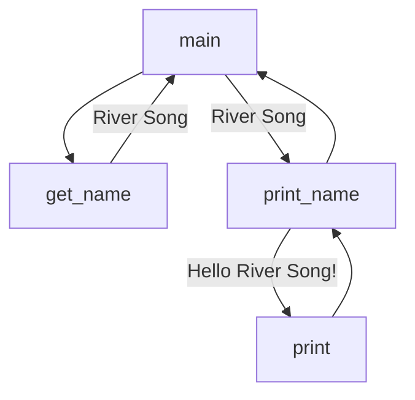

# Team Activity: Functions

Functions are very powerful tools that without them, we would not be able to program effectively. The reason why is code reuse and abstraction is essential to good programming. However, the difficulty with functions comes with our own mindset when we approach them. Often we try to do *too much* in a single function, and it becomes difficult to read and understand. Instead, your focus should be making functions as simple as possible (even it it means you have more functions).

## Grading
Grades for team activities will be based on attendance and notes. You must attend, and as a team you need to generate notes that we can confirm your work. Ideally, you upload the notes as a PDF to the team meeting after you build them out or have a shared document everyone in the team meeting can see (including TAs and the instructor). 

> [!TIP] 
> Good notes become a study guide for you and your team! Make sure they include everything you need to help better understand the weekly material. 

### ⭐ Working in Teams ⭐
When working in teams, remember do not let one person do all the work. Make sure to work together, and ask questions. It is also better if different people program, and you all take turns programming for various team assignments.

### Learning Objectives

* Write a function from scratch
* Understand the Define, Document, Implement, Test Approach
* Look at flow charts for programs (function calls)
* Know the key words parameters/arguments, return values, and scope

### Function Syntax

Functions are defined using the `def` keyword, followed by the function name, and then the parameters in parenthesis. The function body is indented, and the function is closed with a colon. 

```python
def my_function(parameter1, parameter2):
    """ This is a docstring, it is used to describe the function. """
    # function body / your code
    return # optional return statement, but most functions *should* return something
```

### Function Parameters (Args)
Function Parameters also called Arguments (Args) are the variables that are passed into the function. These variables are only available within the function, and are not accessible outside of the function. 

### Function Return 
Functions can return a value, or they can return nothing. If a function does not return anything, it is said to return `None`. However, good function design will often have functions returning a value. This allows one to map a set of inputs (parameters) to a set of outputs (return values). 

#### :memo: Discussion:  
 As a group discuss the following questions:
 - What is the purpose of a function?
 - What is the difference between a function parameter and a function return?
 - What are some things you notice about the syntax of a function?
 - What are major questions you at this point?


## Visualizing Flow of Functions

A function can do one thing, but it can do it very well. This is the idea of abstraction. We can take a complex task, and break it down into smaller tasks. Each of these smaller tasks can be a function. This allows us to focus on the smaller tasks, and then combine them together to solve the larger problem.

The problem then comes to how do we visualize the flow of functions? The answer is to use a flowchart. The chart looks at the "high level" of how the functions interact. And then a separate flow chart is created for each function that looks the the "low level" of how the function works.

### High Level Flowchart

Let's take the following code as an example:

```python
def main():
    """ Main program entry point. """
    # Get the user's name
    name = get_name()
    # Print the user's name
    print_name(name)

def get_name():
    """ Get the user's name. """
    name = input("What is your name? ")
    return name

def print_name(name):
    """ Print the user's name. """
    print(f"Hello {name}!")

# Main entry point for the program
if __name__ == "__main__":
    main()
```

Here is a potential flowchart for the program, assuming the client enters "River Song" as their name.



For each function, we have a call (invoke) to the function, and then we have the return value. The return value is then passed to the next function. You can see the values being passed based on the words on the arrows. If None is passed/returned, then the arrow is blank.

These diagrams are meant to be high level! For the actual code of the functions, you still want to treat each function separately. 

> [!IMPORTANT]    
> Functions are meant to be small, and do one thing. This allows us to break down complex problems into smaller problems. It also means when writing a function - focus on the ONE thing it is supposed to do. Don't worry about the rest of the program until you are done with the function.

### :fire: TASK: Create a Flowchart
Go back to Homework 01, and write a flowchart for star_rating_app.py. The functions themselves didn't have much in the way of parameters, but they did have return values for you to think about. Discuss the results. 


## Writing Functions 
When ever you work on a function, you want to follow these four steps:

1. Define
2. Document
3. Implement
4. Test

* Define: Write the function header (def statement), but more importantly, figure out what you need for the function to work (parameters), and what the function will return (return value).
* Document: Write the docstring for the function. This is a description of what the function does, and what the parameters are, and what is returned. This is part of your definition, but by writing it in prose, you are getting an idea of what to write. It is common to put types of the values in the docstring, but this is not required.
* Implement: This is your actual writing of the function that *does one thing*. You should only work on a few lines at a time, and often you try to run it even if you know it won't work. 
* Test: **BEFORE** moving onto other functions, write a test function to test your function. Yes, it seems slow writing two functions every time, but the time you save debugging later often makes up for it.

### Example:

I have been given the task of calculating the difference between two colors using the euclidean distance formula. RGB stands for the red, green, blue color values. You will explore them in Homework 03. The formula can be represented as

$$\frac{\sqrt{(R1-R2)^2+(G1-G2)^2+(B1-B2)^2}}{441}$$

Knowing my problem takes in two colors, I can **define** my function as follows:

```python
def delta(red1: int, green1: int, blue1: int, red2: int, green2: int, blue2: int) -> float:
    pass # this is used so code will still run, but does nothing
```

In the above definition I am using **type hints**. They are not required, but I find them helpful in
understanding what the function is expecting. It could also be written as

```python
def delta(red1, green1, blue1, red2, green2, blue2):
    pass # this is used so code will still run, but does nothing
```

My next step is to document, so I have a better understanding of what to do. 

```python
def delta(red1: int,  green1: int, blue1: int, red2: int, green2: int, blue2: int) -> float:
    """ Calculate the difference between two colors using the euclidean distance formula.
    The formula can be represented as

    euclidean_distance = sqrt((red1-red2)^2+(green1-green2)^2+(blue1-blue2)^2)
    scaled_distance = floor(euclidean_distance) / 441 # 441 is the max distance between two colors

    Args:
        red1 (int): The red value of the first color.
        green1 (int): The green value of the first color.
        blue1 (int): The blue value of the first color.
        red2 (int): The red value of the second color.
        green2 (int): The green value of the second color.
        blue2 (int): The blue value of the second color.
    
    Returns:
        float: The difference between the two colors.
    """
```

Now I have an idea of every parameter, and what I need to return. I can now **implement** the function. 

```python
def delta(red1: int,  green1: int, blue1: int, red2: int, green2: int, blue2: int) -> float:
    """ Calculate the difference between two colors using the euclidean distance formula.
    The formula can be represented as

    euclidean_distance = sqrt((red1-red2)^2+(green1-green2)^2+(blue1-blue2)^2)
    scaled_distance = floor(euclidean_distance) / 441 # 441 is the max distance between two colors

    Args:
        red1 (int): The red value of the first color.
        green1 (int): The green value of the first color.
        blue1 (int): The blue value of the first color.
        red2 (int): The red value of the second color.
        green2 (int): The green value of the second color.
        blue2 (int): The blue value of the second color.
    
    Returns:
        float: The difference between the two colors.
    """
    euclidean_distance = math.sqrt((red1-red2)**2+(green1-green2)**2+(blue1-blue2)**2)
    scaled_distance = math.floor(euclidean_distance) / 441 
    return scaled_distance
```

Great, I have the distance, but I am NOT DONE yet! I need to **test** my function. I will write a test function that will call my function. This is often written in a separate file, that imports the function to test it! 

```python
import colors #assuming my file is named colors.py

def test_delta():
    """Runs multiple tests on the delta function."""
    error_count = 0
    # Test 1
    if colors.delta(0, 0, 0, 0, 0, 0) != 0.0:
        print("Test 1 using 0,0,0,0,0,0 failed!")
        error_count += 1
    # Test 2
    if colors.delta(255, 255, 255, 0, 0, 0) != 1.0:
        print("Test 2 using 255,255,255,0,0,0 failed!")
        error_count += 1
    # Test 3
    if round(colors.delta(255, 255, 255, 127, 127, 127), 2) != 0.5:
        print("Test 3 using 255,255,255,127,127,127 failed!")
        error_count += 1
    return error_count

def main():
    """ Main entry point of the program. """
    error_count = 0
    error_count += test_delta()
    # add other function calls as i write the tests
    if error_count == 0:
        print("All tests passed!")
    else:
        print(f"{error_count} tests failed!")
```

This seems like a lot for every function, but if I accidentally typed `red1+red2` instead of minus, it would be a *very* difficult error to catch later. By writing the test function, I can catch the error right away.

:memo: Discussion: Remind yourself  what are edge cases? Did I test for edge cases in the example?

# Functions and Scope

A powerful feature of functions is that they have their own "scope". This means that variables defined in the function are not accessible outside of the function. This is a good thing, as it allows us to reuse variable names. 

```python
def print_name(name):
    """ Print the user's name. """
    print(f"Hello {name}!")

def spoiler(name):
    if name == "River Song":
        name = "Melody Pond"
    return "Spoiler"


def main():
    name = "River Song"
    print_name(name)
    spoiler(name)
    print_name(name)
```

:memo: Discuss: what happens in the above code. What is the output? Why?
> [!TIP]
> You should also use the python visualizer to see what happens. Step 15 is important to see what happens to the name variable.
[Python Visualizer Link](https://pythontutor.com/render.html#code=def%20print_name%28name%29%3A%0A%20%20%20%20%22%22%22%20Print%20the%20user's%20name.%20%22%22%22%0A%20%20%20%20print%28f%22Hello%20%7Bname%7D!%22%29%0A%0Adef%20spoiler%28name%29%3A%0A%20%20%20%20if%20name%20%3D%3D%20%22River%20Song%22%3A%0A%20%20%20%20%20%20%20%20name%20%3D%20%22Melody%20Pond%22%0A%20%20%20%20return%20%22Spoiler%22%0A%0A%0Adef%20main%28%29%3A%0A%20%20%20%20name%20%3D%20%22River%20Song%22%0A%20%20%20%20print_name%28name%29%0A%20%20%20%20spoiler%28name%29%0A%20%20%20%20print_name%28name%29%0A%0Amain%28%29&cumulative=false&curInstr=0&heapPrimitives=nevernest&mode=display&origin=opt-frontend.js&py=3&rawInputLstJSON=%5B%5D&textReferences=false)  
You will notice every function has its own 'frame' (location in memory) which helps control the different scopes. 

### Visualizing Returns

When a function returns a value, that value is passed back to the function that called it. This is important to understand, as it allows us to build functions that can be used in other functions.  It is also useful as functions can return the values of another function call. Let's look at a more complicated example.

```python

def get_age():
    """ Get the user's age. """
    age = int(input("What is your age? "))
    if age < 1:
        print("try again")
        return get_age()
    return age
```

:memo: Discuss: what happens in the above code. Then run the visualizer to see what happens.

[Python Visualizer Link](https://pythontutor.com/render.html#code=def%20get_age%28%29%3A%0A%20%20%20%20%22%22%22%20Get%20the%20user's%20age.%20%22%22%22%0A%20%20%20%20age%20%3D%20int%28input%28%22What%20is%20your%20age%3F%20%22%29%29%0A%20%20%20%20if%20age%20%3C%201%3A%0A%20%20%20%20%20%20%20%20print%28%22try%20again%22%29%0A%20%20%20%20%20%20%20%20return%20get_age%28%29%0A%20%20%20%20return%20age%0A%0Aget_age%28%29&cumulative=false&curInstr=0&heapPrimitives=nevernest&mode=display&origin=opt-frontend.js&py=3&rawInputLstJSON=%5B%5D&textReferences=false)

By doing the above we added some (minor) error checking on client input, and we can use a function to create a loop in our code! This is a very powerful idea, we will come back to later in the semester. 

## Functions Review

Functions are powerful tools, and they help take large problems and break them up into more solvable parts.
With every function make sure you repeat the mantra.

1. Define
2. Document
3. Implement
4. Test

This will help you focus your attention on making sure the function does ONE thing and ONE thing well. While we won't always follow this rule (especially in the beginning as we are still lacking some major tools), it is a good rule to follow.


## Last Task: Work on Coding-Practice
Make sure to work on the [Coding Practice Problems](https://github.com/CS5001-khoury/Resources/blob/main/PracticeProblems.md). Have each member of your group pick a different problem, and you will all work on your problems. Make sure to discuss your solution with the team, and paste your code to your *teams* meeting channel / upload the python .py file! 

At the end of every Team Activity, you will be encouraged to work on coding practice problems as a team. It is important you take this time to talk about solutions, approaches, and make suggestions to each other! You are building a skill needed for technical interviews, and like all new skills it is important to practice.  Some times do the practice problems after the meeting, but then use the chat to comment. Either is fine, but it is important to get feedback and ask questions. 


## Submission
There is no "submission" for the Team Activity. Make sure you have your notes for the meeting (can be a doc in the files section) in your team's meeting channel. The TAs will check the attendance logs and award points based on attendance and completed notes. 