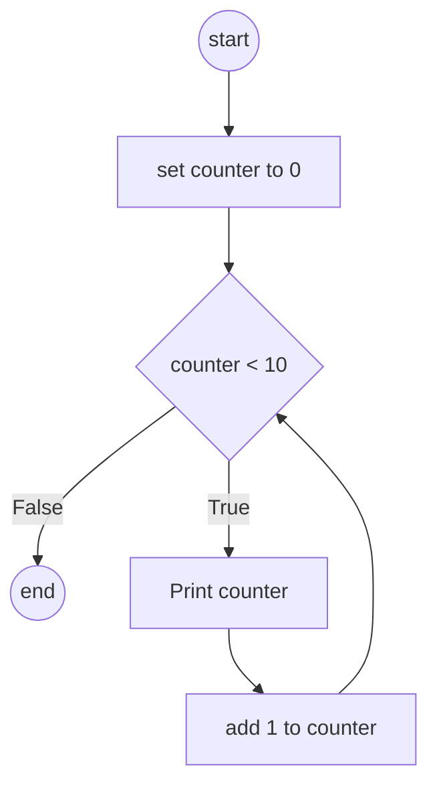

# While loop and Abstraction Discussion

In this Team Activity, you will warm up using learning about `while` loops, and then explore the concept of abstraction building an small application to illustrate the idea.

## Grading
Grades for team activities will be based on attendance and notes. You must attend, and as a team you need to generate notes that we can confirm your work. Ideally, you upload the notes as a PDF to the team meeting after you build them out or have a shared document everyone in the team meeting can see (including TAs and the instructor). 

> [!TIP] 
> Good notes become a study guide for you and your team! Make sure they include everything you need to help better understand the weekly material. 

### ⭐ Working in Teams ⭐
When working in teams, remember do not let one person do all the work. Make sure to work together, and ask questions. It is also better if different people program, and you all take turns programming for various team assignments.

### Learning Objectives

* Describe the importance of looping for flow control
* Write a while loop - knowing the conditions to stop
* Draw the flow chart representing a loop in code
* More on functions and default parameters
* Describe the purpose of abstraction in working with functions

## Part 1: While Loops

Computers are really good at three things:
1. Quick numeric calculations
2. Logical steps
3. Repeating an action very quickly, with small changes

These are also things humans, in general, are bad at doing.  To repeat an action, can be accomplished multiple ways, and `while` loops are one tool.

As a reminder a while loop follows this format:

```python
while(condition):
    ## statements you want to repeat
```
Stated in english, 

> while the condition is true, repeat this block of code. 

### Example
```python
counter = 0
while(counter < 10):
    print(counter)
    counter += 1  # add one to counter
```

This can be presented as



:memo: Discussion: What will be printed? 

:fire: Task: Put the code into your IDE or the [python visualizer](https://pythontutor.com/visualize.html#code=&cumulative=false&heapPrimitives=nevernest&mode=edit&origin=opt-frontend.js&py=311&rawInputLstJSON=%5B%5D&textReferences=false) and try it out!

### Using While Loops for Input Validation

If we try the following code in python

```python
a_number = int(input("Enter an int number: "))
```
and someone enters in anything but a whole number, the program will crash!

```console
>>> a_number = int(input("Enter an int number: "))
Enter an int number: exit
Traceback (most recent call last):
  File "<stdin>", line 1, in <module>
ValueError: invalid literal for int() with base 10: 'exit'
```

> [!NOTE]
> Thinking further, a `ValueError` is something we can use in the future, 
> and something we can try to detect. However, we will come to that later!
> At this point, we know we are trying to convert a non-number to a number.


Instead, we can use `.isnumeric()` to determine if the person entered a whole number before trying to convert.

:fire: Task: To understand isnumeric() try the following by creating a function, and putting it into the function.

Remember you can use the code [template].

```python
prompt = "Enter a value (x to stop): "
value = input(prompt)
while value != 'x':
    print(f"Is {value} numeric?", value.isnumeric())
    value = input(prompt)
```


:memo: Discussion: What are some values that isnumeric() returns True? What are some numbers but it still returns False? Why do you think it is doing that?

> [!WARNING]
> **Computers have limitations**  
> isnumeric() looks at each character and determines if it is a digit (0,1,2,3...9) or not. That is it! As such, decimals and negative numbers aren't counted due to the dash and the period characters in them. For our current purposes that is fine. We will explore a better way to handle numeric
> input later in the semester (using ValueError)


## Part 2: Thinking About Functions and Abstraction

:fire: Task: Let's start off by writing a function that prints even numbers from 0-10. Work on that with your partners, call the function **number_print**.

Remember, when writing a function, follow the steps
1. Define - what are the parameters you need (so far none), name, 
2. Document - write the docstring telling us what it does, what to expect
3. Implement - run as you write, every few lines
4. Test - before you write other functions

A useful operator for this task will be modulo (`%`), which returns the remainder of the division. If the remainder is 0, that means a number is equally divisible. For example, 

```python
is_divisible = (9 % 3) == 0  # True
is_divisible = (10 % 3) == 0 # False
```

### Adding Default Arguments

Thinking about `number_print`, we could make it more generalized. Instead of it only doing even numbers to 10
we could set it up do even numbers up to `max`. However, we want it to max at 10 values if nothing is provided - thus enter default arguments!

```python
def number_print(max = 10):
    counter = 0
    while(counter < max):
        ### your other code here
```

The above change allows you to call `number_print()` or `number_print(100)`. Make that modification, and do that now! This gives us more power with a single function without it adding too much complexity to our code. Remember to test!

*memo* Discussion: how you can do this with your divisor (was probably 2 when you wanted even numbers). Why? Because a more abstract way to look at the the "print even numbers" is to say "print numbers divisible by 2". We can say, well what if that is just a parameter. My function can then turn into print numbers divisible by...

Go ahead and work on that problem now.

> [!TIP]
> Ease of use matters. As such, after we complete the our new number print, we may want to create an evens function. However, we don't want to 'rewrite' what we already did! Instead, we can use number_print.
> ```python
> def evens():
>   """Prints even numbers from 0 to 10"""
>   number_print() # since divisor is 2 by default, and it maxes 10 by default
> 
> def number_print(divisor = 2, max = 10):
>    ## your code here
> ```
> The above gives both flexibility and ease of use making sure we keep our code DRY (**D**on't **R**epeat, **Y**ourself)

### Odd numbers

Let's say we want to print odd numbers from 0 to 10. Do we copy and paste number_print, and change the sign of our compare? While that would work, the moment we start to copy and paste, we should pause. Can we add a variable that changes how we print numbers in number_print? 

:memo: Discuss if adding a parameter would help make number_print more flexible?

:fire: Task: work on writing a single number_print, that can print both numbers that are divisible by and numbers not divisible by. We suggest the following for your function definition

```python
def number_print(divisor = 2, max = 10, invert = False):  ## your default can be True, just depends on how you work on it.
```

Note you are now dealing with multiple variables for your if/else statement. Try to draw out the logic first!

Our final output looked like the following:

```console
Running test_number_print()...
Default
0
2
4
6
8
10

Print evens to 18
0
2
4
6
8
10
12
14
16
18

Div by 3
0
3
6
9

Odd numbers
1
3
5
7
9

All numbers up to 9, not divisible by 3
1
2
4
5
7
8

```

## Abstraction

The following team activity focused on how we think about problems. When looking at functions, you tend to ask yourself:
1. How can I make this one task
2. How can I make this generalized

This balance can be an art, that comes with practice. When in doubt, it is alright to write something out, and then
modify it as you think more about the problem! It is always better to start writing, than get stuck in a thinking loop without doing anything. 

Last but not least, remember

1. Define
2. Document
3. Implement 
4. Test

For  *a* solution to the problem look at [code.py] in the same directory. There are additional things in the file
so you can run tests or play with code, but you can also load it into python and run number_print() with various arguments. You should try out this code, and discuss the solution. :memo: **Anything stand out as a question?**


## Last Task: Work on Coding-Practice
Make sure to work on the [Coding Practice Problems](https://github.com/CS5001-khoury/Resources/blob/main/PracticeProblems.md). Have each member of your group pick a different problem, and you will all work on your problems. Make sure to discuss your solution with the team, and paste your code to your *teams* meeting channel / upload the python .py file! 

At the end of every Team Activity, you will be encouraged to work on coding practice problems as a team. It is important you take this time to talk about solutions, approaches, and make suggestions to each other! You are building a skill needed for technical interviews, and like all new skills it is important to practice.  Some times do the practice problems after the meeting, but then use the chat to comment. Either is fine, but it is important to get feedback and ask questions. 


## Submission
There is no "submission" for the Team Activity. Make sure you have your notes for the meeting (can be a doc in the files section) in your team's meeting channel. The TAs will check the attendance logs and award points based on attendance and completed notes. 


[template]: template.py
[code.py]: code.py

