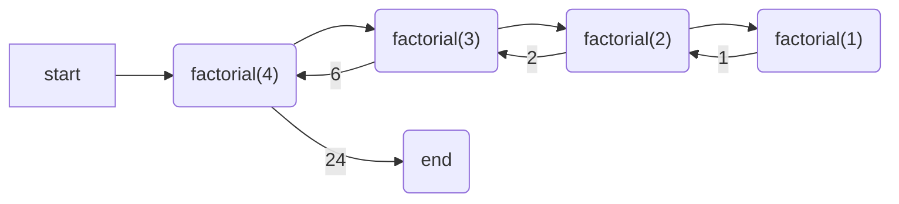

# Module 07 Activity - Recursion 

Recursion is at the heart of **divide**, **conquer**, and **glue**. Why? Because many problems can often be broken up 
into simple cases, and then solving that simple case builds the solution to more complex cases. 

The problem is people often overcomplicate their point of view, and the solution is to try to force yourself to
think into the simplest terms.  

In this activity, we will cover some base examples of recursion, and then explore more complex example to help
get a better understanding of why recursion.  Recursion is a topic you will continue to come across when working
within computer science, so don't worry if it takes a bit to understand! As a reminder, if you are
struggling you are learning. 


## Factorial
One of the  most common recursive "entry" problem is factorial. A factorial is the product of
integers with all integers smaller than it until 1.

$$5! = 5 * 4 * 3 * 2 * 1$$

However, $5!$ can also be represented as

$$5! = 5 * 4!$$

and $4!$ can be 

$$ 4! = 4 * 3! $$

This means you start to see a **pattern** in the problem. It is 

$$n * (n-1)! $$  

Until $n=1$ which then it just is 1 for the answer!

## Coding Factorial?

We can code a `while` loop for factorial using a counter. 

```python
def factorial_iterative(n: int) -> int:
    counter = 2
    factorial = 1
    while counter <= n:
        factorial *= counter 
        counter += 1
    return factorial 
```

### Task: Write and Document
> **TASK**  
> Write out factorial in a file. Make sure to include a full docstring including examples of input/output. Then
> write test function to test factorial. Question: Did writing a full docstring with examples help you determine the 
> tests to consider? 

#### Advanced  Feature / Discussion 
When you write a docstring with tests, the format is often what you would see if you ran the function in python 
directly. For example:

```python
def factorial_iterative(n: int) -> int:
    """
    description
    
    Examples:
        >>> factorial_iterative(1)
        1
        >>> factorial_iterative(4)
        24
        
    Args:
        n (int): description 
         
    Returns:
        int: describe what is returned
    """
```
 
If you use the above format, this is a command line program you can run that will run the tests in the documentation.

```terminal 
> python -m doctest -v filename.py
```

While using [doctest] isn't required, for *pure* functions (no printing, input, or variable mutation), it saves
time testing as you don't have to write the tests if they are documented in docstrings and doctests is run!

## Coding Factorial Recursively 

Recursive functions have **at least two** parts always.  

### Part 1 - Base Case
The first thing you think about with a recursive function is the base or simplest case. For factorial, that is "1" 
or arguably 1 or 0 as $0!$ is defined to be 1. 

You always write the base case first!

```python
def factorial(n: int) -> int:
    if n == 0 or n == 1:
        return 1  # done, exit the function immediately 
```

If I run the above, it works for factorial 0 or factorial 1.

### Part 2 - Recursive Condition

The next part is you consider your recursive condition. Above we defined it as:

$$n! = n * (n-1)!$$

converting that to code we would get

```python
def factorial(n: int) -> int:
    if n == 0 or n == 1:
        return 1  # done, exit the function immediately 
    return n * factorial(n-1)
```

When we run this function, we can "draw it out" by doing the following



Note: start and end are often not included when sketching out function calls like this

### TASK: Visualize it
As a group use [python tutor] to run the recursive function, and see the function stack and how it builds. Run it
with a variety of input, and then try to "draw out" the results on your own. 


## Why Recursion - Deep Dive?

The most common struggle students have learning recursion is the "why". We just showed it can be done with a loop
why do we need to use recursion? However, let's say we wanted to take the product of all values in a list.

```python
def product_values_list(values) -> float:
    rtn = 1.0 
    for i in values:
        rtn *= i 
    return rtn

test = (10, 2.2, 23, 5, 15)
sol = product_values_list(test)
print(sol)
```
Ok... But what if we wanted to add the ability to have more lists or single values in the list?

```python
test = (10, ((1, 2), 4, (13, 2), 10))
```
Seems weird but depending on where you are getting the data, that is possible. 

### Discuss? 
Can you still use a loop to access all the values? If you use `type()` or [`isinstance()`](https://www.w3schools.com/python/ref_func_isinstance.asp) 
it may be possible, but you would have to know exactly how many nested lists. 

Let's make it harder. Let's say you have list of lists, and you don't know how many you will have. Something like the 
following!

```python
test = (10, (1, (2, 4, (13, 2)), 10))
```
> If your head is hurting, that is alright!

The above structure is impossible to do with loops, as the number of nested lists is infinite. However, recursively,
it is possible, as recursion looks at the simple case and builds up. 

```python
def product(value) -> float:
    if isinstance(value, float) or isinstance(value, int):
        return value  # base case, we have just a single number no list
    if len(value) > 1:
        return product(value[0]) * product(value[1:])
    return product(value[0])
```
The above code can be challenging. We encourage you to run it in [python tutor](https://pythontutor.com/render.html#code=def%20product%28value%29%20-%3E%20float%3A%0A%20%20%20%20if%20isinstance%28value,%20float%29%20or%20isinstance%28value,%20int%29%3A%0A%20%20%20%20%20%20%20%20return%20value%20%20%23%20base%20case,%20we%20have%20just%20a%20single%20number%20no%20list%0A%20%20%20%20if%20len%28value%29%20%3E%201%3A%0A%20%20%20%20%20%20%20%20return%20product%28value%5B0%5D%29%20*%20product%28value%5B1%3A%5D%29%0A%20%20%20%20return%20product%28value%5B0%5D%29%0A%20%20%20%20%0Atest%20%3D%20%2810,%20%281,%20%282,%204,%20%2813,%202%29%29,%2010%29%29%0Aproduct%28test%29&cumulative=false&curInstr=0&heapPrimitives=nevernest&mode=display&origin=opt-frontend.js&py=3&rawInputLstJSON=%5B%5D&textReferences=false) to get a better understanding, but
you do not have to fully understand. You will cover what is known as "recursive data structures" in a later class!


## Last Task: Work on Coding-Practice
Go ahead and pick select coding practices from Modules 01-06, and work on them. Also, since we have passed the HARD CUT OFF for homeworks 01-05 (note: this may vary semester to semester, so make sure to check). You can now discuss as a group some of your solutions. What did you do differently? What did you do the same?  Did someone do something more effectively than you? Discuss the differences between your solutions.  

Obviously, don't do this with any homework that is still open! You do not want to encourage plagiarism, but code reviews are a very powerful skill to learn. Use this time to practice reviewing code and discussing solutions.


## Submission
There is no "submission" for the Team Activity. Make sure you have your notes for the meeting (can be a doc in the files section) in your team's meeting channel. The TAs will check the attendance logs and award points based on attendance and completed notes. 


[doctest]: https://docs.python.org/3/library/doctest.html
